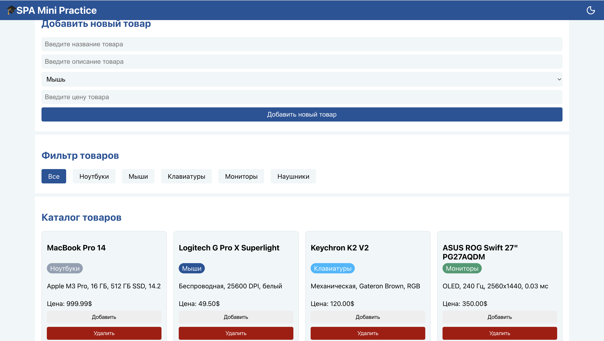

<h1>
    
    SPA Mini Practice
</h1>

## Установка 🔧

1. Клонировать репозиторий
2. Перейте в папку репозитория
3. Скачать зависимости (npm install)
4. Скрипт для запуска (npm start)

## Основные вопросы 🎓

**Что такое «однонаправленный поток данных» в React? Почему это удобно?**    

Архитектурный шаблон, при котором данные перемещаются от родительского компонента к дочернему через props. 
Главными плюсы:
* предсказуемость компонентов - легко отследить источник данных и причину изменения
* упрощенная отладка
* высокая производительность,
* независимость компонентов ( 
Компоненты можно переиспользовать, получают данные извне через props),
* строгий порядок.

**Что такое lifting state up? Приведите пример из Вашей практической работы.**   
Поднятие состояние из дочернего к родительскому компоненту. Например, поднимаем состояние из filterPanel в App.js, чтобы использовать active filter в app js и передавать результат фильтра в другие компоненты в app.js

**Как дочерний компонент сообщает родителю о событии? Почему нельзя изменить state родителя напрямую?**  
Дочерний компонент получает от родителя callback функцию, которую он использует для изменения состояния родителя. Изменять state напрямую нельзя, так как react не узнает об изменениях и не перерисует интерфейс. Только через сеттер.

**Что такое управляемый компонент (controlled component)? Зачем нужен атрибут value у input?**  
Элемент формы, значение которого хранится в state, а не в дом и управляется через обработчик событий. Необходим для обеспечения единого источника данных, мгновенной валидации, динамического управления. 

**Что такое паттерн «компонент-обёртка» (wrapper component)? Как работает children?**  
Это компонент, который содержит в себе другие компоненты или элементы и определяет общую структуру, стили, логику. Children prop позволяет автоматически передавать контент, находящийся между открывающим и закрывающим тегами компонента.

**Почему в React предпочтительна композиция, а не наследование?**  
* Большая гибкость
* Низкая связанность компонентов
* Ясная структура кода

**Зачем нужен useEffect для работы с localStorage? Что такое «побочный эффект» (side effect)?**
useEffect необходим для выполнения побочных эффектов в функциональных компонентах.  Позволяет синхронизировать компонент с внешними системами (API, dom, bom) после рендеринга, не блокируя отрисовку интерфейса. 
Побочный эффект - любое действие компонента, затрагивающее область вне его текущей функции рендеринга.
Побочные эффекты выполняются с помощью useEffect, useLayoutEffect 
В данной работе используем useEffect для загрузки данных из localstorage.

**Почему нельзя выполнять побочный эффект непосредственно в теле функционального компонента?**  
Так как это нарушает предсказуемость рендеринга и производительность.

**Нужно ли добавлять все реактивные значения внутрь []?**
Нет только те что в setup функции  

**Что такое синтетические события (SyntheticEvent). Преимущества?**  
Кроссбраузерная "обертка" над нативным событием браузера.  
* Кроссбраузерность
* Производительность(делегирование)
* Совместимость с нативными событиями
* Очистка(автоматическое удаление синтетического события после выполнения обработчика для повышения производительности)

**Жизненный цикл компонента**  
* Монтирование (Добавление в DOM)
* Обновление (Изменения props, state)
* Размонтирование (Удаление из DOM)

